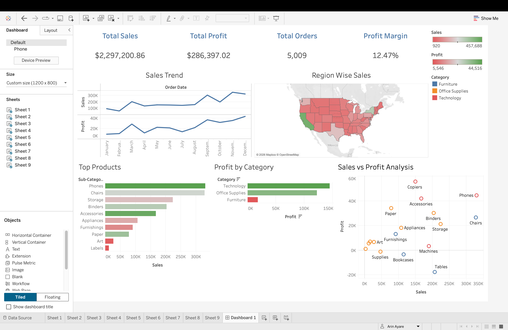

# Superstore Sales and Revenue Analysis

## Project Overview
This project is an interactive **Sales & Revenue Dashboard** built in **Tableau** using the **Sample Superstore dataset**.  
The dashboard helps analyze business performance across **sales, profit, products, and regions**.

It is designed to support **data-driven decision making** by identifying revenue trends, profitable categories, and underperforming regions.

---

## Objective
To analyze retail sales data and create an interactive dashboard that answers key business questions such as:

- How are sales trending over time?
- Which products and categories generate the highest revenue?
- Which regions perform best in sales and profit?
- What are the key profit-driving and loss-making areas?

---

## Tools & Technologies Used
- **Tableau**
- **Excel**
- **Data Cleaning**
- **Exploratory Data Analysis (EDA)**
- **Data Visualization**
- **Dashboard Design**
- **KPI Tracking**

---

## Key KPIs Tracked
- **Total Sales**
- **Total Profit**
- **Total Orders**
- **Total Quantity Sold**
- **Profit Margin %**

---

## Dashboard Features
- Revenue trend over time
- Top-selling products / sub-categories
- Region-wise sales analysis
- Profitability breakdown
- Interactive filters for:
  - Region
  - Category
  - Segment
  - Order Date

---

## Key Insights
- Identified high-performing and low-performing regions
- Analyzed product categories contributing most to sales
- Detected sub-categories with high sales but low profit
- Compared overall revenue and profitability trends

---

## Files in this Repository
- `Superstore Sales and Revenue Analysis.twbx` → Tableau dashboard file
- `Sample - Superstore.xlsx` → Dataset used
- `Dashboard.png` → Dashboard preview image

---

## Dashboard Preview

---

## How to Use
1. Download the repository files
2. Open `Supertore Sales and Revenue Analysis.twbx` in Tableau
3. Explore the interactive dashboard

---

## Resume Value
This project demonstrates skills in:
- Tableau Dashboarding
- Business Data Analysis
- KPI Reporting
- Data Visualization
- Analytical Thinking
- Storytelling with Data

---

## Author
**Arin Ayare**
